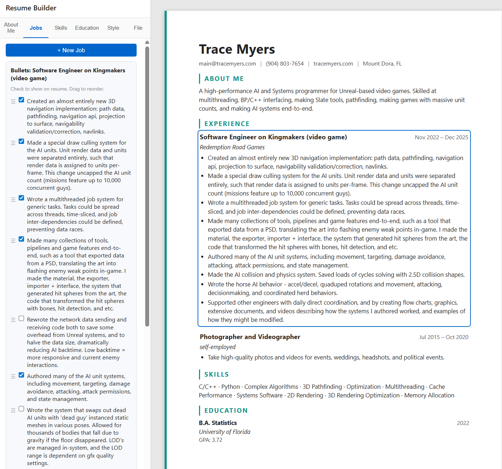

# Resume Builder

A local resume builder that runs entirely in your browser. Just open `index.html` and start building your resume.

All data stays in your browser's local storage. You can save and load resume files manually using the built-in file tab.

## Features

- Add and edit work experience, education, skills, and summary sections
- Reorder and organize job entries
- Multiple style options for the resume layout
- Save/load resume data as JSON files
- Print or export to PDF using your browser's print function

## Usage

Download this repository and open `index.html` in any modern browser.

## Screenshot

